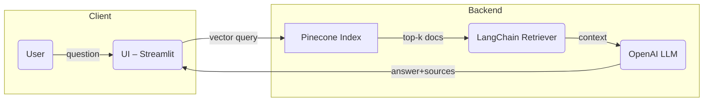

# RAG‑Chatbot

A lightweight **Retrieval‑Augmented Generation (RAG) chatbot** built with **Streamlit**, **LangChain**, **Pinecone**, and **OpenAI**.  
Ask questions about any collection of PDFs and get grounded answers with cited sources in real time.

[Live demo](https://rag-chatbot-saketh.streamlit.app/) 

* Built with ❤️ by **Saketh Angirekula**

---

## ✨ Features
* **Drag‑and‑drop document ingestion** – drop PDFs in `pdf/`, click **Embed Docs** and they are chunked, embedded and pushed to Pinecone.  
* **Hybrid search → generative answers** – combines semantic vector search with an LLM to produce accurate, source‑linked responses.  
* **Multi‑page Streamlit UI** – switch between Chat, Document Upload and Settings from the sidebar.  
* **Stateless & serverless friendly** – no database other than Pinecone; ready for Streamlit Community Cloud or container deploy.  
* **Extensible LangChain pipeline** – swap models, re‑rankers or vector stores with just a few lines of code.

---

## 🏗 Architecture


## 📂 Project structure

| Path               | Purpose                                                               |
| ------------------ | --------------------------------------------------------------------- |
| `home.py`          | Landing page & global Streamlit config                                |
| `pages/`           | Additional Streamlit pages (`Chat.py`, `Upload.py`, `Settings.py`, …) |
| `functions/`       | Utility modules — `chunks.py`, `embed.py`, `qa_chain.py`, etc.        |
| `pdf/`             | Sample documents and any files you upload                             |
| `requirements.txt` | Minimal dependency pinning                                            |

## ⚡ Quick‑start

```bash

# 1 Clone & set up
git clone https://github.com/Saketh1702/RAG-chatbot.git
cd RAG-chatbot
python -m venv .venv && source .venv/bin/activate
pip install -r requirements.txt     # Python 3.10+

# 2 Add your secrets
export OPENAI_API_KEY="<your‑key>"
export PINECONE_API_KEY="<your‑key>"
export PINECONE_ENV="gcp-starter"
export PINECONE_INDEX="rag-chatbot"

# 3 Ingest documents (optional – adds all PDFs in pdf/)
python functions/embed.py

# 4 Run the app
streamlit run home.py
```
Tip: Create a .env file and use python‑dotenv if you don’t want to export keys every time.

## 🔧 Configuration

| Variable           | Description                 |
| ------------------ | --------------------------- |
| `OPENAI_API_KEY`   | Key for chat / embeddings   |
| `PINECONE_API_KEY` | Vector store access         |
| `PINECONE_ENV`     | Region (e.g. `gcp-starter`) |
| `PINECONE_INDEX`   | Index name to read/write    |

Model & retriever parameters (chunk size, overlap, top‑k, temperature) live in functions/qa_chain.py.

## 🚀 Deployment
Streamlit Community Cloud

1. Fork the repository.

2. Add Secrets (OPENAI_API_KEY, PINECONE_API_KEY, …) in the dashboard.

3. Click Deploy – done!

### Docker
```bash
docker build -t rag-chatbot .
docker run -p 8501:8501 \
  -e OPENAI_API_KEY -e PINECONE_API_KEY -e PINECONE_ENV -e PINECONE_INDEX \
  rag-chatbot
```
## 🤝 Contributing
Pull requests are welcome! Please open an issue first to discuss major changes.

Bug fix – branch from main, write a test, open PR

Feature – describe use‑case in an issue and wait for approval

Docs – typos & clarifications are highly appreciated


## 🙏 Acknowledgements
[Streamlit](https://streamlit.io) – rapid data apps

[LangChain](https://python.langchain.com/) – LLM orchestration

[Pinecone](https://www.pinecone.io/) – managed vector database

[OpenAI](https://openai.com/) – GPT & embeddings API

